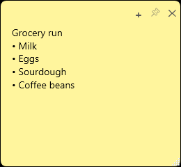
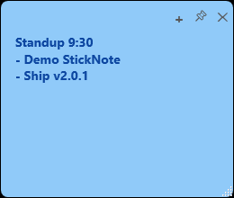
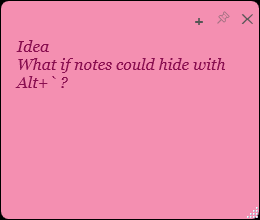
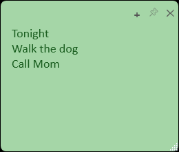
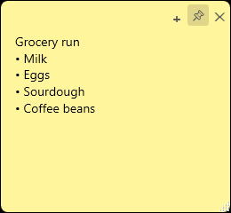
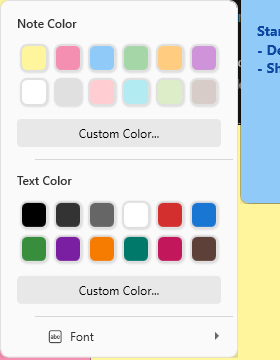

# StickNote

A modern sticky-notes app for Windows. Notes live on your desktop, save automatically, and stay out of the way until you need them.



## Quick start

1. Download **StickNote-win-x64.zip** from [Releases](https://github.com/Samuel8946/sticky-note/releases).
2. Run `StickNote.exe` (.NET 8 runtime required).
3. On first launch, a visual guide walks through the essentials. You can open it later from the tray: **How to use StickNote**.

Hide or show every note at any time with **Alt+`**.

## How to use

### 1. Write anything

Click a note and type. Lists, reminders, and ideas all save by themselves.


### 2. Color-code your notes

Right-click the **title bar** (not the text) and pick a note color so work, home, and ideas stay distinct.



### 3. Make it your font

Right-click → **Font** to change family, size, bold, and italic.



### 4. Change the text color

Same menu → **Text Color**. Useful for headings or making one line stand out.



### 5. Pin on top

Click **📌**. Pinned notes stay visible over other windows — including after Win+D.



### 6. Make another note

Click **+** on any note, or double-click the tray icon.


### 7. Hide, show, and style

Press **Alt+`** to hide all notes, then press it again to bring them back.

Right-click the title bar for note color, text color, and fonts:



## Tray menu

- New Note
- Show / Hide All Notes (`Alt+``)
- Start with Windows
- How to use StickNote
- Exit

## Requirements

- Windows 10/11
- [.NET 8 Desktop Runtime](https://dotnet.microsoft.com/download/dotnet/8.0)

## Data

Notes are saved to `%AppData%\StickyNoteV2\notes.json`.

## Build

```bash
dotnet publish -c Release -o publish-v2
```
